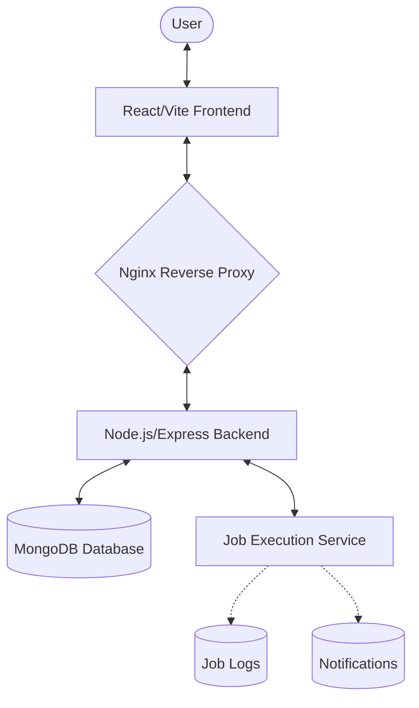

# Chronos - Job Management System

Chronos is a full-stack job management platform designed to schedule, execute, and monitor background tasks. It provides a comprehensive system for managing one-time and recurring jobs with integrated logging and user notifications.

## 🚀 Project Overview

### Backend
The backend is a Node.js/Express server built with TypeScript and MongoDB.
- **Core Features**:
  - **Job Scheduling**: Support for one-time and recurring (cron-based) jobs.
  - **Execution Engine**: A dedicated service to handle job lifecycle, retries, and failure reporting.
  - **Auth System**: JWT-based authentication with secure password hashing.
  - **Notification System**: Real-time alerts for job success, failure, or cancellation.
  - **Monitoring**: Comprehensive audit trails via execution logs.

### Frontend
A modern React-based dashboard built with Vite, TypeScript, and Tailwind CSS.
- **Features**:
  - **Job Dashboard**: Real-time monitoring of all active tasks.
  - **Form Builder**: Intuitive interface for scheduling complex tasks.
  - **Rich UI**: Premium design system with dark mode, glassmorphism, and smooth animations.
  - **Log Explorer**: Deep dive into execution history for debugging.

## 🏗️ System Architecture

Chronos uses a decoupled architecture to ensure scalability and ease of deployment.



## 🧠 Design Decisions

- **TypeScript Everywhere**: Used across both the backend and frontend to ensure strict type safety, reducing runtime errors and improving developer productivity.
- **Mongoose for Modeling**: Chosen for its robust schema validation and middleware support, which is critical for maintaining data integrity in the job queue.
- **Nginx Reverse Proxy**: In production/Docker, Nginx acts as the single point of entry, handling SPA routing and proxying `/api` requests to the backend. This simplifies SSL termination and CORS management.
- **Tailwind CSS + Glassmorphism**: Selected to create a "Premium" aesthetic while maintaining a lightweight CSS bundle. Utility classes allow for rapid UI iteration without leaving the HTML.
- **Stateless Authentication**: Uses JWTs stored in the frontend to handle sessions, allowing the backend to remain stateless and easily scalable.

## 🛠️ Tech Stack

| Layer | Technology |
| :--- | :--- |
| **Frontend** | React 19, Vite, TypeScript, Tailwind CSS, Axios, React Router 7 |
| **Backend** | Node.js, Express 5, TypeScript, Mongoose |
| **Database** | MongoDB |
| **Orchestration** | Docker, Docker Compose, Nginx |
| **Authentication** | JSON Web Tokens (JWT), bcrypt |
| **Testing** | Vitest, Supertest |

## 🚦 Getting Started

### Local Development

1. **Clone & Install**
   ```bash
   git clone <repository-url>
   cd Chronos
   pnpm install -r # Install all dependencies
   ```

2. **Environment Setup**
   *   Copy `Backend/.env.sample` to `Backend/.env` and update the values.
   *   Copy `frontend/.env.example` to `frontend/.env`.

3. **Run Services**
   ```bash
   # From root
   cd Backend && pnpm run dev
   # In another terminal
   cd frontend && pnpm run dev
   ```

### Docker Deployment (Recommended)
The easiest way to run the entire stack (Database + Backend + Frontend + Proxy):

```bash
docker-compose up -d --build
```
*The application will be available at `http://localhost`.*

## 📜 API Documentation

### Authentication
#### `POST /api/v1/users/register`
*   **Body**: `{ "email": "user@example.com", "password": "password123" }`
*   **Response**: `201 Created` with user details.

#### `POST /api/v1/users/login`
*   **Body**: `{ "email": "user@example.com", "password": "password123" }`
*   **Response**: `200 OK` with JWT token.

### Jobs Management
#### `POST /api/v1/jobs` (Protected)
*   **Body**:
    ```json
    {
      "name": "Daily Cleanup",
      "jobType": "recurring",
      "schedule": "0 0 * * *",
      "payload": { "task": "cleanup" }
    }
    ```
*   **Response**: Created Job object.

#### `POST /api/v1/jobs/:id/execute` (Protected)
*   Manually triggers an immediate execution of a specific job.

## 🧪 Testing

The system includes unit and integration tests covering core business logic.

```bash
cd Backend
pnpm run test          # Run tests
pnpm run test:coverage # View coverage report
```
